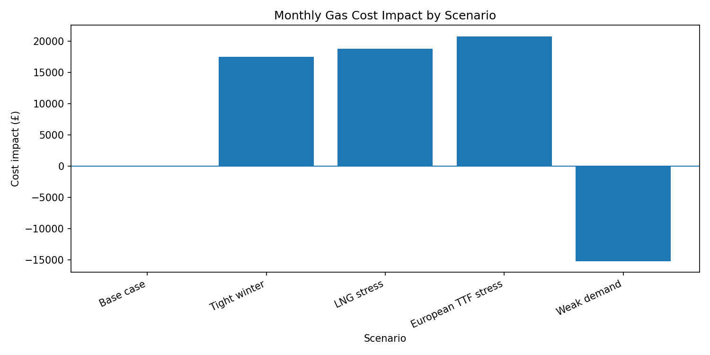
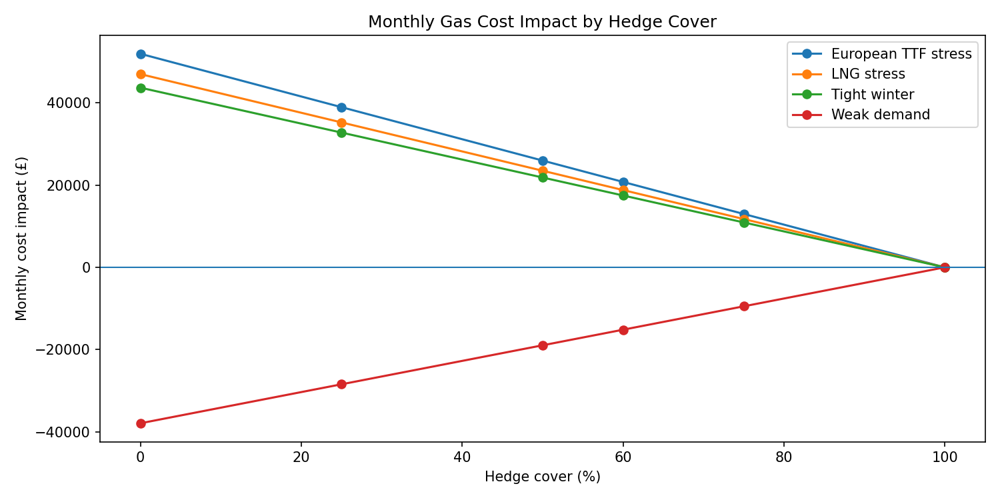
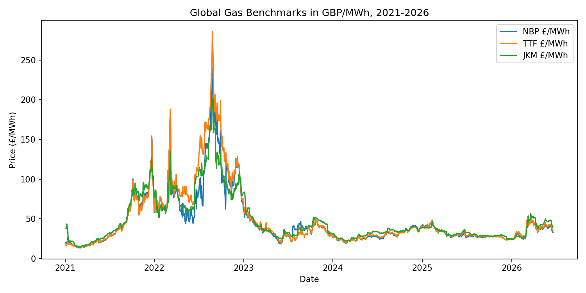
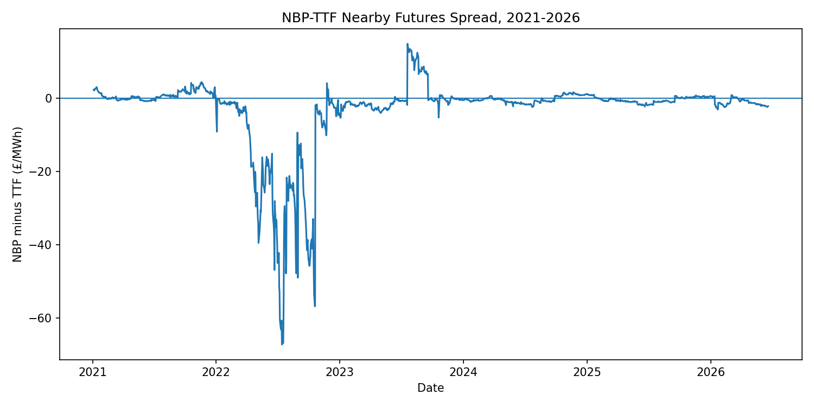

# UK Gas Price Pressure and Exposure Model: Final Summary

## Project question

How can physical gas-system pressure, traded gas benchmarks and global LNG context be combined into a commercial exposure model for a UK gas-exposed buyer?

## Business case

The model considers a UK medium-sized food manufacturer using 10,000 MWh of gas per month.

The buyer is assumed to have 60% hedge cover, leaving 4,000 MWh exposed to floating gas prices.

The latest NBP benchmark price used in the scenario model is £32.99/MWh.

## Python workflow

The Python pipeline cleans and combines weather, power-system, storage, LNG, SAP, NBP, TTF, JKM and FX data.

The work is split into four layers:

1. Physical gas pressure model using HDD, wind shortfall and storage.
2. Price response testing using SAP, NBP and TTF.
3. Global gas benchmark layer using NBP, TTF and JKM in £/MWh.
4. Commercial exposure scenario model for a UK buyer.

## Main modelling result

The physical Gas Tightness Index is useful as a local pressure indicator, but it does not explain short-term gas price movements as strongly as traded market benchmarks.

The NBP, TTF and JKM benchmark layer shows that UK gas prices are connected to European and global gas markets. NBP and TTF are especially closely linked, while JKM adds wider LNG-market context.

## Commercial scenario result

The largest adverse scenario is **European TTF stress**, with an estimated monthly commodity cost impact of £20,785 at 60% hedge cover.

The most favourable scenario is **Weak demand**, with an estimated monthly commodity cost impact of £-15,176.

Under the European TTF stress case:

- 0% hedge cover gives an estimated cost impact of £51,962/month.
- 60% hedge cover gives an estimated cost impact of £20,785/month.

This shows how hedge cover reduces exposure to gas market stress.

## Commercial interpretation

A UK gas-exposed buyer should not rely only on local physical indicators such as weather, wind and storage. Those drivers matter, but traded benchmarks such as NBP and TTF carry much of the short-term price signal.

A stronger procurement workflow should combine:

- local physical gas pressure;
- NBP and TTF market pricing;
- JKM/global LNG context;
- hedge cover;
- unhedged volume;
- scenario-based cost impact.

## Limitations

This is a scenario model, not a forecast. The scenario shocks are transparent assumptions rather than estimated future prices.

The hedge calculation assumes the hedged volume is protected at the current NBP price. In reality, hedge cost depends on tenor, liquidity, execution timing and contract structure.

JKM is used as a price benchmark only because reported Barchart volume is low or zero for much of the sample.

## Final conclusion

The project shows how Python can be used to build a market-data pipeline and commercial gas exposure model. It connects physical UK gas-system indicators, traded European benchmarks and global LNG pricing into a practical scenario framework for estimating buyer cost risk.

## Key charts

### Commercial exposure by scenario

### Hedge sensitivity

### Global gas benchmarks

### NBP-TTF spread

## Important data note

Raw vendor data is not included in this repository. The project includes code, processed summary outputs, charts, source documentation and analyst notes. Raw Barchart downloads are excluded from GitHub using `.gitignore`.
